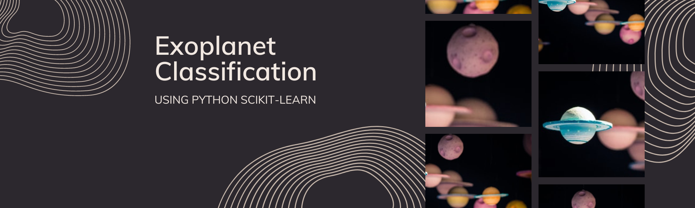
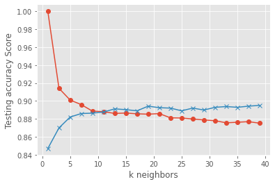

# ml-classification-1

Author: Erin James Wills, ejw.data@gmail.com  

  
<cite>Photo by [David Menidrey](https://unsplash.com/@cazault?utm_source=unsplash&utm_medium=referral&utm_content=creditCopyText) on [Unsplash](https://unsplash.com/s/photos/planets?utm_source=unsplash&utm_medium=referral&utm_content=creditCopyText)</cite>  

## Overview  

  

This repo uses Kepler telescope data to create a classification algorithm that identifies potential planets.  Several algorithms were tested including `logistic regression`, `random forest`, `decision trees`, `k-nearest neighbor`, and `SVN`.  The k-nearest neighbor model was selected and tuned using `GridSearchCV`.  The parameters `C` and `gamma` were varied and last `classification_report` was used to evaluate some of the promising models.    

   

## Technologies  
*  Python
*  Scikit-Learn  
    *  train_test_split()
    *  MinMaxScaler()
    *  LabelEncoder()
    *  LogisticRegression()
    *  RandomForestClassifier()
    *  DecisionTreeClassifier()
    *  KNeighborsClassification()
    *  SVC()
    *  Classification_report()
    *  GridSearchCV()
   

## Methods  
*  Train Test Split  
*  GridSearch Optimization  
*  Hyperparameter Tuning  
*  Multiple Classification Comparision
*  Scoring 

   

## Data Source  
The dataset I am using originated from this kaggle dataset:  https://www.kaggle.com/datasets/nasa/kepler-exoplanet-search-results  

   

## Setup and Installation  
1. Environment needs the following:  
    *  Python 3.6+  
    *  Scikit-Learn  
1. Activate your environment
1. Clone the repo to your local machine
1. Start Jupyter Notebook within the environment from the repo
1. Run `gridsearchcv.ipynb` 

 

## Analysis  

The best model was the K-NearestNeighbors with paramets for 'C' and 'gamma' to be 32, 0.00001 respectively.  The model accuracy was 0.88 verus the untuned model accuracy of 0.85.  

 

## Examples    

